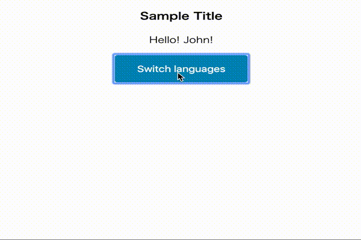

# try-i18n-at-react

Switch lang sample using [react-intl](https://github.com/yahoo/react-intl)



## Usage

Start sample app.

Access to `localhost:3000`

```
yarn dev
```

Lint check and Code format

```
yarn fmt
```
